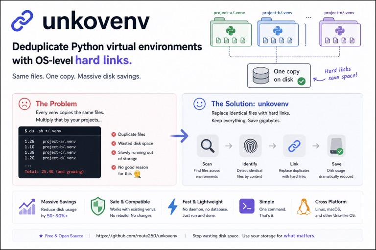

[日本語版 README](./REAME_ja.md)



# unkovenv

Deduplicate duplicated files in Python virtual environments by hard-linking `site-packages` files into a shared content-addressed store.

## Overview

`unkovenv` scans files under `lib/python*/site-packages`, calculates SHA-256 for each file, stores unique blobs in a shared store, and replaces original files with hard links to those blobs.

This reduces disk usage when you have many virtual environments with overlapping dependencies.

Default store path:

- `$HOME/.cache/unkoenv`

## Features

- `add`: Register a venv and deduplicate files
- `gc`: Remove orphan blobs and broken venv links
- `status`: Show managed venv count, blob count, and estimated saved bytes
- `--dry-run`: Preview changes without modifying files
- `--verbose`: File-level logs

## Requirements

- macOS (BSD userland commands)
- Bash or Zsh
- One of the following hash tools:
  - `shasum -a 256`
  - `sha256sum`
  - `openssl dgst -sha256`

## Usage

```bash
# deduplicate one virtual environment
./unkovenv add /path/to/.venv

# dry-run with verbose logs
./unkovenv add /path/to/.venv --dry-run --verbose

# garbage collection
./unkovenv gc

# status
./unkovenv status
./unkovenv status --json
```

Environment variables:

- `UNKOENV_STORE`: override store path (highest priority)
- `UNKOENV_STORE_DIR`: override store path (fallback)

## Exit Codes

- `0`: success
- `1`: generic error (arguments, permissions, I/O)
- `2`: prerequisite failure (`venv` or `site-packages` not found)
- `3`: lock acquisition failed
- `4`: cross-device hard link error (`EXDEV`)

## Notes

- Hard links require the venv and store to be on the same filesystem.
- `__pycache__` and `*.pyc` are excluded from deduplication.
- Operations are designed to be idempotent.

## Tests

```bash
./tests/test_unkoenv.sh
```

## License

MIT. See [LICENSE](./LICENSE).
